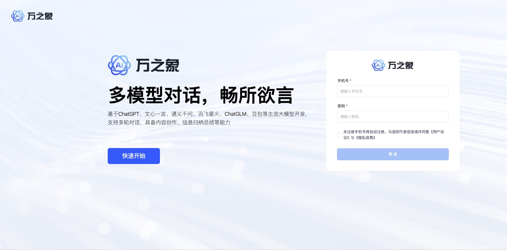
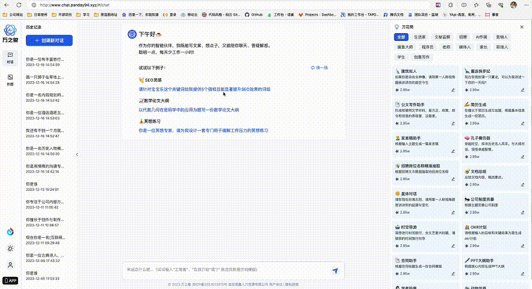

# Chat MASTER

<p>
    <a href="#联系我们"></a>
</p>


> 声明：此项目只发布于码云和GitHub，基于 MIT 协议，免费且作为开源学习使用，禁止转卖、谨防受骗。如需商用必须保留版权信息，请自觉遵守。确保合法合规使用，在运营过程中产生的一切任何后果自负，与作者无关。

# 项目简介
ChatMASTER，基于AI大模型api实现的自建后端Chat服务，支出同步响应及流式响应，完美呈现打印机效果。支持一键切换ChatGPT(3.5、4.0)模型、月之暗面（Kimi）、文心一言(支持Stable-Diffusion-XL作图)、通义千问、讯飞星火、智谱清言(ChatGLM)等主流模型，后续模型持续对接中。
项目包含java服务端、网页端、移动端及管理后台配置。

GitHub直通车[点我传送](https://github.com/panday94/chatgpt-master)

欢迎小伙伴或有合作意向一起加入交流群[添加微信](#联系我们)或提Issues。使用参考下面具体介绍：

* 已支持月之暗面（Kimi）模型，支持文心一言Stable-Diffusion-XL作图功能
* 内置了各种assistant模版，按指定prompt输出，也可后台创建assistant模版
* 支持切换模型对话聊天，保存对话记录及根据上下文输出
* 管理端端采用Vue2、Element UI，Chat网页端使用Vue3、TypeScript、NaiveUI进行开发
* 服务端采用Spring Boot、Spring Security + JWT、Mybatis-Plus、Lombok、 Mysql & Redis，代码通俗易懂，上手即用
* 完善的权限控制，权限认证使用Jwt，支持多终端认证系统
* 管理端项目，请移步[chat-master-admin](https://gitee.com/panday94/chat-master-admin)
* 网页端项目，请移步[chat-master-web](https://gitee.com/panday94/chat-master-web)
* 移动端项目，请移步[chat-master-uniapp](https://gitee.com/panday94/chat-master-uniapp)
* 如需了解更多可访问[这里](https://www.yuque.com/the6/ct0azl/ehxcgoy0xg41l9c3?singleDoc# 《ChatMASTER部署教程》)
* 阿里云折扣场：[点我进入](https://www.aliyun.com/minisite/goods?userCode=iqguofg4)，腾讯云秒杀场：[点我进入](https://curl.qcloud.com/11y0ob0f)&nbsp;&nbsp;
* 阿里云优惠券：[点我领取](https://www.aliyun.com/daily-act/ecs/activity_selection?userCode=iqguofg4)，腾讯云优惠券：[点我领取](https://curl.qcloud.com/EUbjrCcu)&nbsp;&nbsp;

## 演示

网页端演示地址：https://gpt.panday94.xyz 移动端可[扫码体验](#联系我们)

管理端演示地址：https://gpt.panday94.xyz/admin  密码：master chatmaster




## 已实现功能
1. 多模型对话，支持ChatGPT(3.5、4.0)、月之暗面（Kimi）、文心一言(支持Stable-Diffusion-XL作图)、通义千问、讯飞星火、智谱清言(ChatGLM)
2. 支持后台配置及使用assistant模版，按指定prompt输出
3. 存储历史对话及聊天内容，可开启/关闭根据上下文输出
4. 支持按使用次数或者开通会员使用，也可全局判断不校验使用次数及会员，电量赠送次数或者不校验电量可在[chat-master-admin](https://gitee.com/panday94/chat-master-admin)中进行配置
5. 支持分享功能（基础上开发）
6. 支持个人信息修改

## 模型功能对比

> 版本记录请查看这里[版本记录](./CHANGELOG.md)

| 模型      | 是否支持System  | 天气查询       | 绘画                 |
|---------|-------------|------------|--------------------|
| ChatGPT | 支持          | 不支持        | 支持                 |
| 文心一言    | 不支持(传递会报错) | 可以回复(不准)   | 使用Stable-Diffusion-XL |
| 通义千问    | 支持          | 支持(效果没讯飞好) | 未接入                |
| 讯飞星火    | 支持 | 支持(准)      | 不支持                |
| 智谱清言    | 支持  | 不支持        | 支持（API待接入目前有点贵）    |
| 月之暗面    | 支持  | 不支持        | 支持文档问答             |

## 内置功能
1. 工作台：集成多个应用和功能的系统页面，该页面主要为用户提供快速访问、信息聚会、个性化等功能。
2. 数据中心：用于管理和分析系统数据的功能，向用户提供直观和易懂的信息，方便使用者快速了解系统数据。
3. 聊天管理：可以后台查看所有模型回复内容。
4. 订单管理：可以接入充值赠送模型使用次数功能。
5. 会员中心：查看所有用户信息，及开通模型次数功能。
6. 助手中心：配置Assistant分类及prompt信息。
7. 配置中心：配置系统可使用模型及移动端信息配置。
8. 系统管理：对系统中基础业务进行管理维护。
9. 系统监控：针对系统运行状态进行查看及定时任务配置管理

## 环境搭建/运行&提示
> ChatGPT需要在后台配置管理中进行站点配置或添加微信交流

``` 
1、idea导入chat-master项目，请更换spring.profiles.active为dev
2、执行doc文件夹下面chat_gpt全量sql文件，在gpt_model配置可运行模型信息，在gpt_openkey配置模型密钥信息
3、版本更新时候需执行doc/update.sql
4、更改application-dev中redis连接和mysql连接配置
5、启动ChatApplication中main方法
```
- com.master.chat.api.base.config.InitBean 初始化模型
- com.master.chat.gpt.service.IGptService 接口调用
- com.master.chat.gpt.service.SseService sse调用

### 开发环境

| 工具    | 版本号   | 下载                                                                                   |
|-------|-------|--------------------------------------------------------------------------------------|
| JDK   | 1.8   | https://www.oracle.com/technetwork/java/javase/downloads/jdk8-downloads-2133151.html |
| Mysql | 5.7   | https://www.mysql.com/                                                               |
| Maven | 3.6.3 | https://maven.apache.org/                                                            |
| nginx | 1.10  | http://nginx.org/en/download.html                            ｜                       |

## 参与贡献

贡献之前请先阅读 [贡献指南](./CONTRIBUTING.md)

个人的力量始终有限，任何形式的贡献都是欢迎的，包括但不限于贡献代码，优化文档，提交 issue 和 PR 等。
感谢所有做过贡献的人!

## 赞助

如果你觉得这个项目对你有帮助，并且情况允许的话，可以给我一点点支持，总之非常感谢支持～

<div style="display: flex; gap: 20px;">
	<div style="text-align: center">
		
		<p>WeChat Pay</p>
	</div>
</div>

## 联系我们
<div style="display: flex;">
    
</div>

## 扫码进群
<div style="display: flex; gap: 20px;">
    
</div>

## 许可证

[Apache License 2.0](./LICENSE)

Copyright (c) 2023 Master Computer Corporation Limited All rights reserved