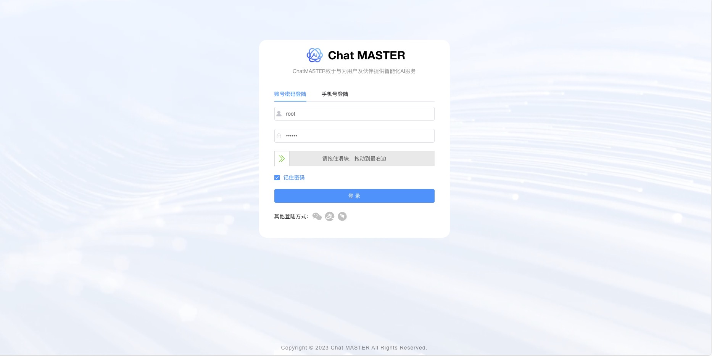
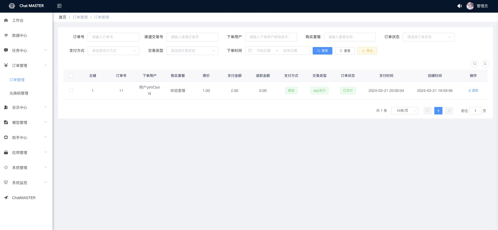
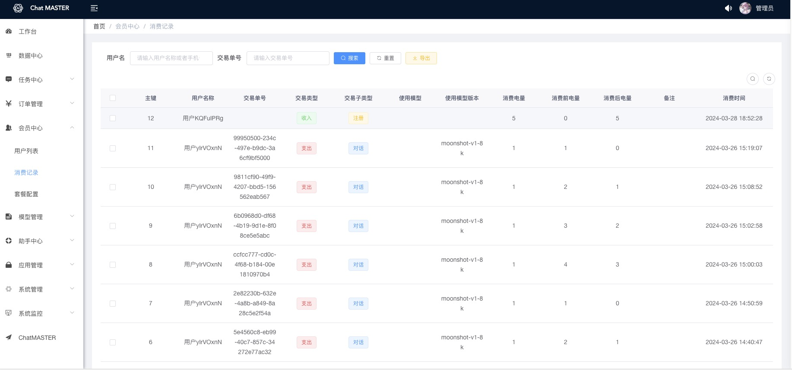
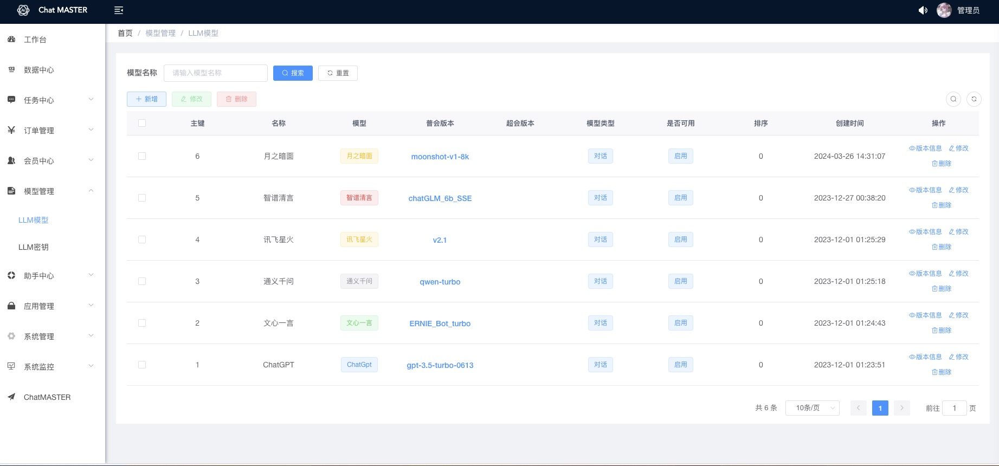

# Chat MASTER

    

> 声明：此项目只发布于码云和GitHub，基于 Apache 协议，免费且作为开源学习使用，禁止转卖、谨防受骗。如需商用必须保留版权信息，请自觉遵守。确保合法合规使用，在运营过程中产生的一切任何后果自负，与作者无关。

# 项目简介
ChatMASTER，基于AI大模型api实现的自建后端对话服务，支出同步响应及流式响应，完美呈现打印机效果。支持一键切换DeepSeek、月之暗面（Kimi）、豆包、ChatGPT(3.5、4.0)、Claude3、文心一言、通义千问、讯飞星火、智谱清言(ChatGLM)、书生浦语等主流模型，并且支持扣子(Coze)和使用Ollama和Langchain进行加载本地模型及知识库问答。
目前已支持Langchain-chatchat、Ollama、扣子（Coze）本地或在线接口调用，Dify、LinkAI、FastGPT对接中。
项目包含java服务端、网页端、移动端及管理后台配置。

> 如果觉得项目好用，请点个Star吧！如需ChatGPT或者Claude支持，可[联系作者](#联系我们)获取。

> 移动端项目暂未开源，若需要及商业版，可[联系作者](#联系我们)获取。

> 支持[一键部署](./deploy/deploy.md)

GitHub直通车[点我传送](https://github.com/panday94/chatgpt-master)

欢迎小伙伴或有合作意向一起加入交流群[添加微信](#扫码进群)或提Issues。使用参考下面具体介绍：

* 支持一键切换DeepSeek、月之暗面（Kimi）、豆包、ChatGPT(3.5、4.0)、Claude3、文心一言、通义千问、讯飞星火、智谱清言(ChatGLM)、书生浦语等主流模型。
* 不仅支持国内外官方模型接口，并且支持使用Ollama和Langchain进行加载本地模型及知识库问答，也可以使用扣子(Coze)的在线api进行使用。LinkAi、FastGPT
* 免费提供多种类型助手按指定prompt输出，也可在管理后台创建自定义助手模版。如需更多万花筒信息可关注公众号[扫码获取](#联系我们)获取
* 管理端端采用Vue2、Element UI，ChatMASTER网页端使用Vue3、TypeScript、NaiveUI进行开发
* 服务端采用Spring Boot、Spring Security + JWT、Mybatis-Plus、Lombok、 Mysql & Redis，代码通俗易懂，上手即用
* 完善的权限控制，权限认证使用Jwt，支持多终端认证系统
* 扫码加入微信群免费获取部署教程[扫码加入](#扫码进群)

* 阿里云折扣场：[点我进入](https://www.aliyun.com/minisite/goods?userCode=iqguofg4)，腾讯云秒杀场：[点我进入](https://curl.qcloud.com/11y0ob0f)&nbsp;&nbsp;
* 阿里云优惠券：[点我领取](https://www.aliyun.com/daily-act/ecs/activity_selection?userCode=iqguofg4)，腾讯云优惠券：[点我领取](https://curl.qcloud.com/EUbjrCcu)&nbsp;&nbsp;

## 演示

网页端演示地址：https://gpt.panday94.xyz 移动端可关注公众号[扫码体验](#联系我们)

管理端演示地址：https://gpt.panday94.xyz/admin/#  密码：master chatmaster

<table>
    <tr>
        <td></td>
        <td></td>
    </tr>
    <tr>
        <td></td>
        <td></td>
    </tr>
	<tr>
        <td></td>
        <td></td>
    </tr>
    	<tr>
        <td></td>
    </tr>
</table>

## 已实现功能
1. 支持后台配置大模型信息及模型版本信息，同时支持配置模型密钥信息
2. 支持后台配置assistant助手模版，按指定prompt输出
3. 支持vip及svip功能，支持兑换码、分享功能，集成微信支付，支持普通商户支持及服务商支付
4. 支持个人信息修改，支持个人用户账号禁用功能
5. 支持按使用次数或者开通会员使用，也可全局判断不校验使用次数及会员，电量赠送次数或者不校验电量可在[chat-master-admin](#)中进行配置
6. 支持配置网站信息，支持对接GPT代理地址及本地代理，支持配置微信公众号、小程序及微信支付信息，支持腾讯oss/sms和阿里云oss/sms
7. 移动端websocket支持

## 待实现功能
1. 文档对话、国内模型绘画
2. 知识库
3. MJ/SD
4. 语音对话
5. 视频生成

## 模型功能对比

> 版本记录请查看这里[版本记录](./CHANGELOG.md)

提示：
1. ChatGPT 可通过`Cloudflare`访问openai接口或者使用代理，ChatGPT及国内模型密钥由后台系统配置，如需代理可[联系作者](#联系我们)获取。

| 名称                                          | 免费？ | 是否国内     | 地址 |
| --------------------------------------------- | ------ | ---------- | ---- |
| ChatGpt                          | 否     | 否       | https://chat.openai.com/ |
| 文心一言 | 否     | 是 | https://yiyan.baidu.com/ |
| 通义千问 | 否     | 是 | https://tongyi.aliyun.com/ |
| 讯飞星火 | 否     | 是 | https://xinghuo.xfyun.cn/ |
| 智谱清言 | 否     | 是 | https://chatglm.cn/ |
| 月之暗面 | 否     | 是 | https://kimi.moonshot.cn/ |
| 书生浦语 | 否     | 是 | https://internlm-chat.intern-ai.org.cn/ |
| 豆包 | 否     | 是 | https://www.doubao.com/ |
| DeepSeek | 否     | 是 | https://chat.deepseek.com/ |

## 内置功能
1. 工作台：集成多个应用和功能的系统页面，该页面主要为用户提供快速访问、信息聚合、个性化等功能。
2. 数据中心：用于管理和分析系统数据的功能，向用户提供直观和易懂的信息，方便使用者快速了解系统数据。
3. 任务中心：可以后台查看模型聊天对话记录及绘画任务记录。
4. 订单管理：查看开通会员订单信息及退款操作。
5. 会员中心：查看所有用户信息，及开通模型次数及消耗电量统计功能。
6. 模型管理：配置大模型及模型版本信息和模型密钥信息。
7. 助手中心：配置Assistant分类及prompt信息。
8. 应用管理：包含内容管理及站点配置
    - 内容管理：用户协议、隐私协议编辑修改，如有需要可增加其他内容
    - 站点配置：基础信息、应用信息、微信信息、oss/sms信息。
        - 基础信息：站点名称、站点logo、配置ChatGPT代理、站点版权、站点描述
        - 应用信息：是否限制访问GPT、是否开启兑换码、是否开启注册短信、是否分享获取电量、注册赠送电量、移动端首页公告
        - 微信信息：包含小程序、公众号、商户号信息等
        - oss/sms信息：配置文件上传及短信密钥
9. 系统管理：对系统中基础业务进行管理维护。

## 模块介绍

| 模块              | 备注  | 
|----------------- |---------------- |
| chat-master-admin   | 管理端代码 （Vue2）         |
| chat-master-server    | 后端服务代码（Java） | 
| chat-master-uniapp    | 移动端Uniapp代码，支持App、小程序、H5 （暂未开源，若需要及商业版，可[联系作者](#联系我们)获取）   |
| chat-master-web    | Web端代码（Vue3）    |

## 💡环境搭建/运行/部署
1. [部署运行教程](./deploy/deploy.md)
2. [常见问题](./doc/常见问题.md)

## 参与贡献

贡献之前请先阅读 [贡献指南](./CONTRIBUTING.md)

个人的力量始终有限，任何形式的贡献都是欢迎的，包括但不限于贡献代码，优化文档，提交 issue 和 PR 等。
感谢所有做过贡献的人!

## 赞助

如果你觉得这个项目对你有帮助，并且情况允许的话，可以给我一点点支持，总之非常感谢支持～

	

		
		
WeChat Pay

	

## 联系我们

    

## 扫码进群

    

## 许可证

[Apache License 2.0](./LICENSE)

Copyright (c) 2023 曜栋网络科技工作室 Limited All rights reserved