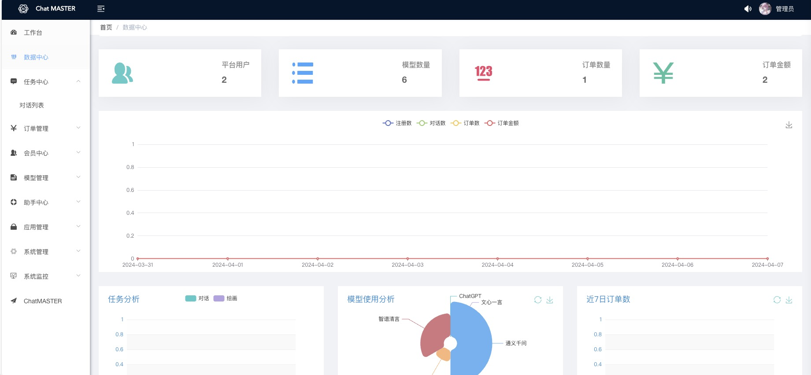
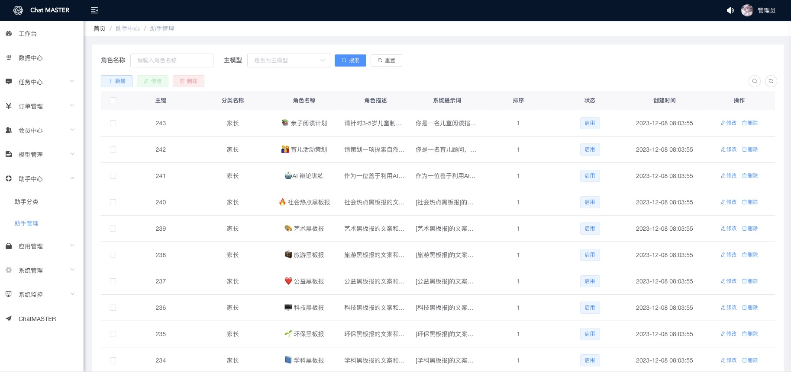
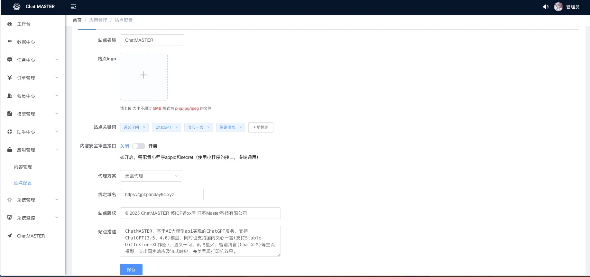

## Chat-Master-Admin

<p>
    <a href="#联系我们"></a>
</p>

> 声明：此项目只发布于码云和GitHub，基于 MIT 协议，免费且作为开源学习使用，禁止转卖、谨防受骗。如需商用必须保留版权信息，请自觉遵守。确保合法合规使用，在运营过程中产生的一切任何后果自负，与作者无关。

# 项目简介
ChatMASTERAdmin，使用VUE、Element-Ui框架搭建的ChatMARTER后台管理项目，用于配制使用模型、密钥及助手等。已对接模型有：ChatGPT、月之暗面、文心一言、通义千问、讯飞星火、智谱清言。
搭配后台[chat-master](https://gitee.com/panday94/chat-master)使用，可以快速搭建属于自己的ChatOwner后台。

GitHub直通车[点我传送](https://github.com/panday94/chatgpt-master)

欢迎小伙伴或有合作意向一起加入交流群[添加微信](#联系我们)或提Issues。

* [RuoYi](https://gitee.com/y_project/RuoYi)
* 服务端项目，请移步[chat-master](https://gitee.com/panday94/chat-master)
* 网页端项目，请移步[chat-master-web](https://gitee.com/panday94/chat-master-web)
* 移动端项目，请移步[chat-master-uniapp](https://gitee.com/panday94/chat-master-uniapp)
* 如需了解更多可访问[这里](https://www.yuque.com/the6/ct0azl/ehxcgoy0xg41l9c3?singleDoc# 《ChatMASTER部署教程》)

* 阿里云折扣场：[点我进入](https://www.aliyun.com/minisite/goods?userCode=iqguofg4)，腾讯云秒杀场：[点我进入](https://curl.qcloud.com/11y0ob0f)&nbsp;&nbsp;
* 阿里云优惠券：[点我领取](https://www.aliyun.com/daily-act/ecs/activity_selection?userCode=iqguofg4)，腾讯云优惠券：[点我领取](https://curl.qcloud.com/EUbjrCcu)&nbsp;&nbsp;

## 演示

网页端演示地址：https://gpt.panday94.xyz 移动端可关注公众号[扫码体验](#联系我们)

管理端演示地址：https://gpt.panday94.xyz/admin  账号密码：master chatmaster

<table>
    <tr>
        <td></td>
        <td></td>
    </tr>
    <tr>
        <td></td>
        <td></td>
    </tr>
	<tr>
        <td></td>
        <td></td>
    </tr>
    	<tr>
        <td></td>
    </tr>
</table>

## 前置要求

### Node

`node` 建议14版本，使用 [nvm](https://github.com/nvm-sh/nvm) 可管理本地多个 `node` 版本

```shell
node -v
```

## 开发

```bash
# 克隆项目
git clone https://gitee.com/panday94/chat-master-admin

# 进入项目目录
cd chat-master-admin

# 安装依赖
npm install

# 建议不要直接使用 cnpm 安装依赖，会有各种诡异的 bug。可以通过如下操作解决 npm 下载速度慢的问题
npm install --registry=https://registry.npmmirror.com

# 启动服务
npm run dev
```

浏览器访问 http://localhost:2345

## 发布

```bash
# 构建测试环境
npm run build:stage

# 构建生产环境
npm run build:prod
```

## 参与贡献

贡献之前请先阅读 [贡献指南](./CONTRIBUTING.md) [版本记录](./CHANGELOG.md)

个人的力量始终有限，任何形式的贡献都是欢迎的，包括但不限于贡献代码，优化文档，提交 issue 和 PR 等。
感谢所有做过贡献的人!

## 赞助

如果你觉得这个项目对你有帮助，并且情况允许的话，可以给我一点点支持，总之非常感谢支持～

接定制开发，欢迎老板下单！

<div style="display: flex; gap: 20px;">
	<div style="text-align: center">
		
		<p>WeChat Pay</p>
	</div>
</div>

## 联系我们
<div style="display: flex;">
    
</div>

## 扫码进群
<div style="display: flex; gap: 20px;">
    
</div>

## License
MIT © [Master](./license)
