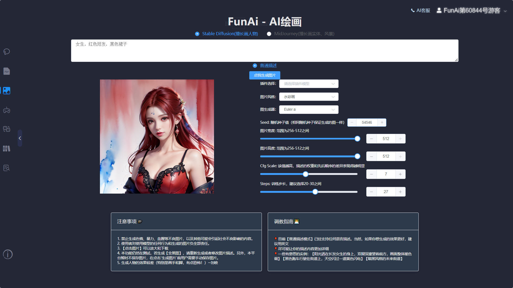
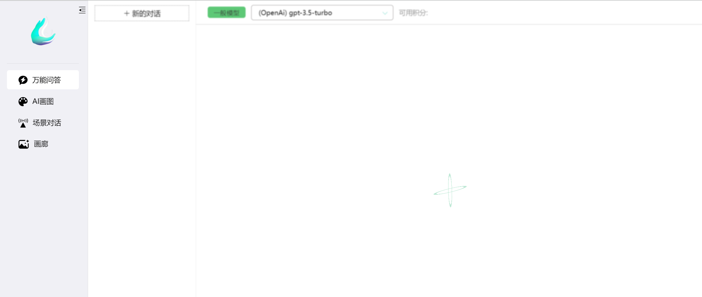

### FunAi

https://github.com/huangPengL/ChatGPT-Java-FunAi

ChatGPT Java 基于SpringBoot的后端开源web学习项目，FunAi。支持OpenAI官方所有接口。无限轮聊天 + 带上下文逻辑 + 流式输出 / 普通输出。PDF解析 + Embedding API+ 递归分词文段抽取 + 文本向量化 + 向量语义匹配 + 召回知识库相似文本匹配。接入文生图模型MidJourney / Stable Diffusion Model。智能客服/企业级知识库。APIKey额度精准查询 + 失效检测。AI游戏 + 专属于AI的社交平台
- 聊天： 可以直接图片聊天，多模态
- 绘画：  没有 绘画功能 调用的Midjourney
- 

- 知识库：  Milvus 或者 Pinecone 文件上传和解析查询
- AI生成场景描述图片

### hugai-chatgpt
https://github.com/TouShang6015/Hugai-chatgpt

- 调用AI绘图Midjourney、Stable Diffusion 
- 聊天： 第一个万能回答 多模态
- 绘画： 第二个ai绘画调用 Midjourney、Stable Diffusion
  

### springboot-openai-chatgpt
https://github.com/274056675/springboot-openai-chatgpt

可以购买

### ai-chat

- https://gitee.com/jsdhxkj/ai-chat
#### 介绍
- 有图片的消息

### uni-ai
https://github.com/qifan777/uni-ai
- 有知识库

