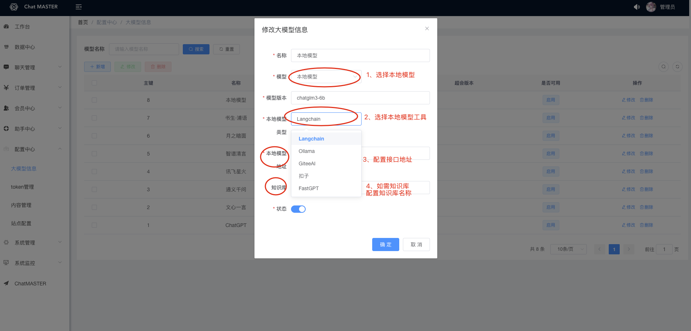

 # ChatMASTER 常见问题 🔫

## chat-master-server
Q: 是否有开通会员功能？

A: 订单表已经建好，系统中引入了wx-java的sdk，可以二次开发会员功能，微信信息可以在配置中心-站点配置-微信信息中修改。或联系作者获取商业版已经支持支付功能。

Q: 如何访问openai接口？

A: 在配置中心-站点配置-基础配置中配置代理方案，如本地开发可以直接选择环境代理，本地科学上网，如有代理地址，可以选择反向代理，并填写反代服务器地址如https://openai.master.com/。如想使用自己代理地址，可参考[]使用CloudFlare方案。

Q: 如何使用本地模型

A: 使用本地模型，可参考[使用Langchain-chatchat](https://github.com/panday94/chatgpt-master/blob/main/doc/Langchain-chatchat.md)和[使用Ollama](https://github.com/panday94/chatgpt-master/blob/main/doc/Ollama.md)，在系统配置中配置本地地址及知识库名称。

## chat-master-admin
Q: 密钥可以在哪里可以进行配置

A: 在配置中心的token管理中进行配置

Q: 万花筒在哪里配置

A: 在后台的助手中心菜单下分别配置助手分类及助手，后台sql中已经提高了一些基础的模版，可在此进行编辑或添加。

Q: 智谱的密钥该如何填写？

A: 智谱密钥中，.前面的为key，.后面的为secret

Q: 是否可以去除使用限制或者修改注册默认赠送电量？

A: 首先在系统管理-参数设置中找到·是否限制访问Chat·配置，如果限制则前往配置中心-站点配置-应用中心的免费体验次数中进行修改，如无限制，则可以无限访问ChatMASTER

Q: 如何要使用oss、sms等？

A: 可以在配置中心-站点配置-拓展信息中进行上传配置及短信配置，默认上传配置为本地上传。oss及sms工具类在包com.master.chat.comm.util中，可自行通过配置实现使用或可以放在yml中使用。如忽略安全因素想省事可以配置在工具类中（不建议）。

Q: 后台admin密码是多少？

A: 默认密码为123456，登陆进去建议先修改密码。

## chat-master-web
Q: 为什么 `Git` 提交总是报错？

A: 因为有提交信息验证，请遵循 [Commit 指南](./CONTRIBUTING.md)

Q: 如果只使用前端页面，在哪里改请求接口？

A: 根目录下 `.env` 文件中的 `VITE_GLOB_API_URL` 字段。

Q: 文件保存时全部爆红?

A: `vscode` 请安装项目推荐插件，或手动安装 `Eslint` 插件。

Q: 前端没有打字机效果？

A: 一种可能原因是经过 Nginx 反向代理，开启了 buffer，则 Nginx 会尝试从后端缓冲一定大小的数据再发送给浏览器。请尝试在反代参数后添加 `proxy_buffering off;`，然后重载 Nginx。其他 web server 配置同理。

## chat-master-uniapp